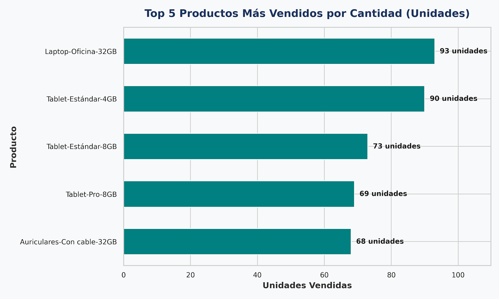
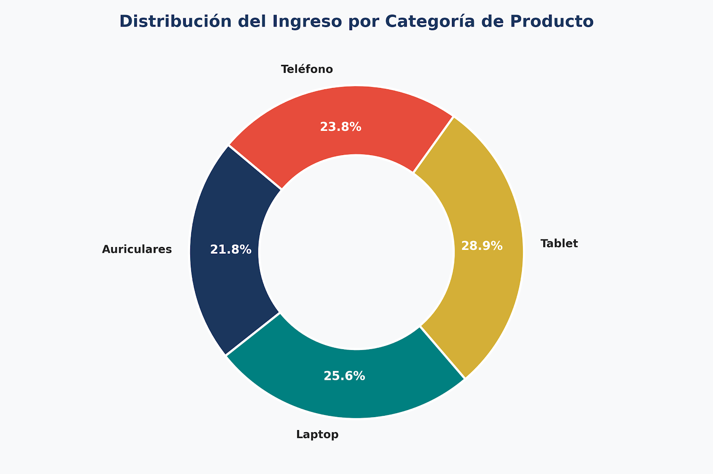
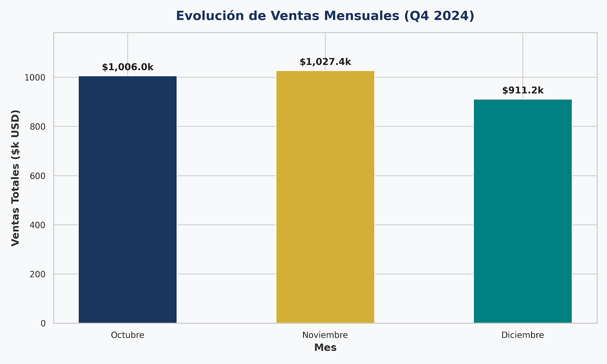
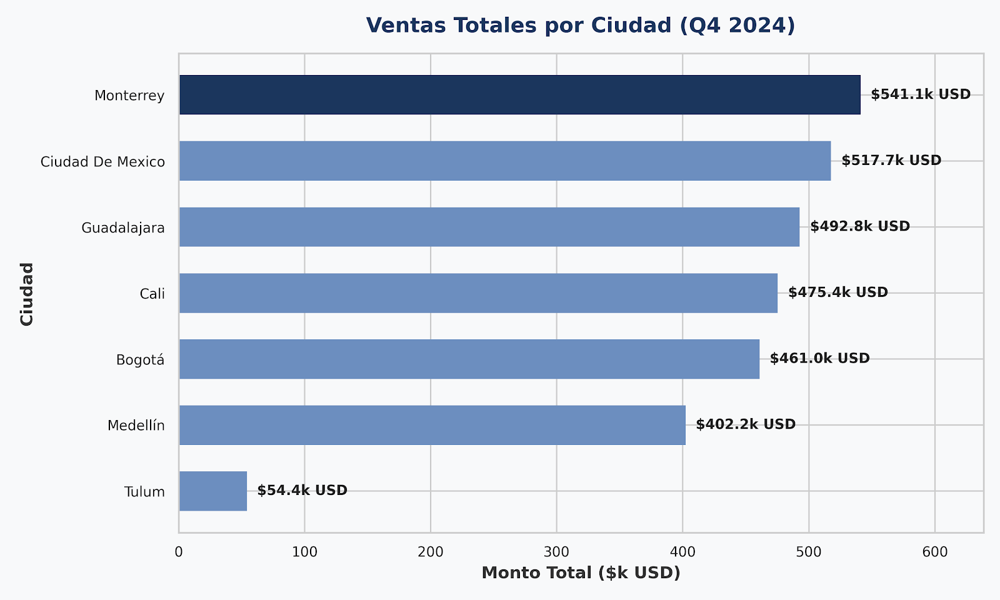

# VentaExpress — Data Cleaning & Sales Analysis

## 📌 Project Overview

This project analyzes Q4 2024 sales data for VentaExpress, an e-commerce business.

The analysis covers data cleaning, sales performance by city, monthly sales trends, product category contribution, and top-selling products.

The goal is to transform raw sales data into reliable business insights and actionable recommendations.

---

## 🎯 Business Objective

The analysis aims to:

- Clean and prepare raw sales data for analysis.
- Evaluate sales performance across cities.
- Analyze monthly sales trends during Q4 2024.
- Identify the product categories generating the highest revenue.
- Identify the best-selling products by units.
- Translate findings into actionable business recommendations.

---

## 🧹 Data Cleaning & Preparation

The project began with a raw Q4 2024 sales dataset.

The cleaning process included:

- Reviewing data quality and consistency.
- Standardizing and correcting city information.
- Preparing fields for analysis.
- Organizing sales data into a structured dataset.
- Creating analysis-ready tables and summaries.

The cleaned dataset was then used to generate the analysis and executive insights.

---

## 📊 Key Findings

### 1. Sales Performance by City

**Monterrey** generated the highest sales during Q4 2024 with **$541,137.36 USD**.

The next strongest markets were:

- **Mexico City:** $517,689.63 USD
- **Guadalajara:** $492,790.52 USD
- **Cali:** $475,400+ USD
- **Bogotá:** $461,000+ USD
- **Medellín:** $402,200+ USD

**Tulum** recorded the lowest sales volume at **$54,394.73 USD**, indicating an opportunity for further market development.

---

### 2. Monthly Sales Performance

**November** was the strongest month of Q4, generating **$1,027,372.46 USD** in sales.

Monthly performance:

- **October:** $1,006,043.65 USD
- **November:** $1,027,372.46 USD
- **December:** $911,204.50 USD

December showed a decline compared with October and November, suggesting a potential seasonal effect that could be investigated further.

---

### 3. Revenue by Product Category

**Tablets** generated the highest share of total revenue, representing **28.9%** or approximately **$850,310.85 USD**.

The product mix was relatively balanced:

- **Tablets:** 28.9%
- **Laptops:** 25.6%
- **Phones:** 23.8%
- **Headphones:** 21.8%

This distribution indicates that revenue is spread across multiple product categories rather than being highly dependent on a single line.

---

### 4. Top Products by Units Sold

The **Laptop-Oficina-32GB** was the best-selling product by volume, with **93 units sold**.

The top five products included:

- **Laptop-Oficina-32GB:** 93 units
- **Tablet-Estándar-4GB:** 90 units
- **Tablet-Estándar-8GB:** 73 units
- **Tablet-Pro-8GB:** 69 units
- **Auriculares-Con cable-32GB:** 68 units

Three of the five highest-volume products were Tablets, highlighting strong demand for this product category.

---

## 💡 Business Recommendations

Based on the analysis:

- Strengthen inventory availability for high-demand products, particularly Tablets and the leading Laptop model.
- Consider targeted marketing initiatives to support growth in lower-performing markets such as Tulum.
- Investigate the December sales decline to better understand seasonal purchasing behavior.
- Continue monitoring the product mix to maintain balanced revenue contribution across categories.
- Use city, category, and product-level performance to support future sales and inventory planning.

---

## 🛠️ Tools & Skills

- **Excel / Google Sheets**
- Data Cleaning & Preparation
- Data Validation
- Sales Analysis
- KPI Analysis
- Data Visualization
- Business Analysis
- Executive Reporting
- Business Insights
- Actionable Recommendations

---

## 📈 Visualizations

### Sales Performance by City



### Monthly Sales Trend



### Revenue by Product Category



### Top Products by Units Sold



---

## 📂 Project Structure

```text
ventaexpress-data-cleaning-sales-analysis/
│
├── README.md
├── VentaExpress_Data_Cleaning_Sales_Analysis.xlsx
│
└── visuals/
    ├── 01_sales_performance_by_city.png
    ├── 02_monthly_sales_trend.png
    ├── 03_revenue_by_product_category.png
    └── 04_top_products_by_units_sold.png
